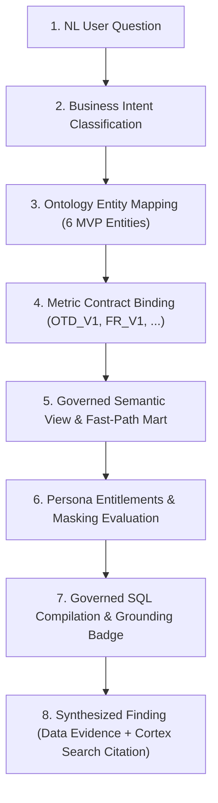

# ONTOLOGYONE ⚡
### Governed Supply Chain Ontology & Conversational Analytics
**Snowflake CoCo CLI Hackathon (GCC Edition) — Track 5**  
**Team Trailblazer** | **Lead: Tenali Radhika**

[](tests/run_suite.py)
[](README.md)
[](cortex-project.yml)
[](docs/architecture.md)

---

## 🎯 The Core Thesis

> ### _"Same question → same governed metric → same calculation → same answer → different authorized context."_

In modern enterprise data warehouses, Row Access Policies (RAP) create a fundamental paradox: when different business personas (Procurement, Logistics, Demand Planning) query company-wide executive KPIs, row-level filters cause the numbers to diverge across dashboards:

- _Procurement VP sees:_ **94.2% OTD**
- _Logistics VP sees:_ **89.7% OTD**
- _Planning VP sees:_ **92.1% OTD**

**OntologyOne permanently eliminates this paradox through the Two-Tier Truth Architecture:**

1. **Tier 1 — Unified Aggregate Truth (`MART_OTD_AGGREGATE`):** A pre-aggregated, RAP-unrestricted certified mart guarantees that executive questions return identical governed values for all personas (**91.4% = 91.4% = 91.4%**).
2. **Tier 2 — Entitled Granular Lineage (`CORE_SHIPMENT`, `CORE_ORDER_LINE`):** Granular drill-downs are strictly governed by Snowflake Row Access Policies and Dynamic Masking (`***CONFIDENTIAL***`).
   > **"Unified Aggregate Truth, Entitled Granular Lineage."**

---

## 🏛️ System Architecture

```
┌────────────────────────────────────────────────────────────────────────┐
│               STREAMLIT IN SNOWFLAKE (SiS) / LOCAL UI                  │
│   [1. Command Center]  [2. Ask OntologyOne]  [3. Ontology Explorer]    │
│                       [4. Trust & Lineage DAG]                         │
└───────────────────────────────────┬────────────────────────────────────┘
                                    │ Natural Language Prompts
                                    ▼
┌────────────────────────────────────────────────────────────────────────┐
│                        SNOWFLAKE CORTEX AGENT                          │
│   • Semantic Analyst Tool (Cortex Analyst text-to-SQL)                 │
│   • Unstructured Evidence (Cortex Search Service)                      │
│   • CoCo Custom Skills: metric_explainer, anomaly_narrator, lineage    │
└───────────────────┬────────────────────────────────┬───────────────────┘
                    │                                │
                    ▼ Structured Data                ▼ Unstructured Evidence
┌───────────────────────────────────────┐  ┌─────────────────────────────┐
│  SEMANTIC VIEW (SUPPLY_SEMANTIC)      │  │ CORTEX SEARCH SERVICE       │
│  • 6 Entities, 5 Relationships        │  │ (DOCS_SEARCH_SERVICE)       │
│  • Metric Contracts: OTD_V1, FR_V1    │  │ • SLA_S017.pdf (§4.2)       │
│  • Verified Queries Fixture Suite     │  │ • freight_agreement (§2.1)  │
│  • Deprecated TRAP column defense     │  │ • legacy_metric_memo        │
└───────────────────┬───────────────────┘  └─────────────────────────────┘
                    │
                    ▼
┌────────────────────────────────────────────────────────────────────────┐
│                        SNOWFLAKE DATA ENGINE                           │
│   • MART: MART_OTD_AGGREGATE (RAP-Unrestricted Certified Mart)         │
│   • CORE: Dynamic Tables (CORE_SHIPMENT, CORE_ORDER_LINE, ...)         │
│   • RAW: Ingestion Staging Tables (EDI-214 feeds)                      │
│   • GOV: Roles (PLANNER, PROCUREMENT, LOGISTICS, JUDGE), RAP, Masking  │
└────────────────────────────────────────────────────────────────────────┘
```

---

## 💡 The Truth Compiler Concept

OntologyOne compiles natural language business inquiries through 8 deterministic stages:



---

## 🔬 5 Planted Deterministic Scenarios (S1 – S5)

| Scenario | Name                                       | Synthetic Data Plant                                                                                                                                                   | Unstructured Document Evidence                                                                  | Expected Agent Finding                                                                                   | Prescribed AI Action                                                                        | Verification Gate                                                |
| :------- | :----------------------------------------- | :--------------------------------------------------------------------------------------------------------------------------------------------------------------------- | :---------------------------------------------------------------------------------------------- | :------------------------------------------------------------------------------------------------------- | :------------------------------------------------------------------------------------------ | :--------------------------------------------------------------- |
| **S1**   | **Supplier Deterioration** (Flagship Demo) | Supplier `S-017` OTD slides **96.2% → 81.7%** over 8 weeks. Impacts plants `P03`, `P07`, `P09`, 17 parts, and 428 late shipments. Drives global OTD down to **91.4%**. | `SLA_S017.pdf` §4.2: Capacity constraint & lead-time revision due to wafer substrate shortages. | Identifies `S-017` as causal driver; isolates late shipment `SH-93821`.                                  | AI-generated recommendation: Trigger supplier review under SLA §2.2; expedite 84 shipments. | Verified via exact counts: 91.4% company, 81.7% S-017, 428 late. |
| **S2**   | **Plant Fill-Rate Problem**                | Plant `P03` chronic fill rate deficit (<78%) while `P07` holds excess capacity.                                                                                        | `regional_policy.txt` §3: Regional balancing protocol.                                          | Flags `P03` fulfillment bottleneck.                                                                      | AI-generated recommendation: Dynamic order reallocation `P03` → `P07`.                      | Fill rate calculation threshold verified.                        |
| **S3**   | **Freight Surcharge Anomaly**              | Transit lane `LANE-NW-04` landed freight cost spikes **+30%**.                                                                                                         | `freight_agreement.pdf` §2.1: Maritime congestion surcharge clause.                             | Identifies lane surcharge spike while piece price remains flat.                                          | AI-generated recommendation: Audit carrier invoices; reroute inland rail.                   | Surcharge ratio calculation verified.                            |
| **S4**   | **Definition Conflict (TRAP)**             | Legacy system column `raw_orders.is_delayed` falsely reports ~94% OTD based on dock dispatch date.                                                                     | `legacy_metric_memo.txt`: Deprecation memo enforcing customer arrival date.                     | **REFUSES** trap column; cites `OTD_V1` contract; reports certified **91.4%**.                           | AI-generated recommendation: Retire legacy column across plant screens.                     | Automated trap-refusal test passed.                              |
| **S5**   | **Access Violation Attempt**               | Non-procurement persona (`ONTO_LOGISTICS`) requests supplier unit costs.                                                                                               | `governance_policy.md`: Cost visibility restricted to `ONTO_PROCUREMENT`.                       | Query costs masked as `***CONFIDENTIAL***`; violation logged. Company OTD remains identical (**91.4%**). | Shows governance consequence; proves aggregate invariance.                                  | 3-persona OTD equality assertion passed.                         |

---

## 🏆 Governance Verification Suite (12/12 PASSED)

Run the full governance suite in one command:

```bash
make test-coco
```

```text
================================================================================
 ONTOLOGYONE -- GOVERNANCE & SEMANTIC VERIFICATION SUITE
 Snowflake CoCo CLI Hackathon Track 5 -- Automated 12-Gate Audit
================================================================================
[01/12] Metric Definition & Calculation | OTD_V1 Flagship (Company Q3 = 91.4%, S-017 = 81.7%, 428 Late) ... [PASSED]
[02/12] Metric Definition & Calculation | FR_V1 Order Fill Rate & Plant P03 Bottleneck (<78%)     ... [PASSED]
[03/12] Metric Definition & Calculation | DOI_V1 Days of Inventory Calculation (Current Stock / Usage) ... [PASSED]
[04/12] Ontology Relationship Integrity | Supplier -> Part Foreign Key & Cardinality Validation   ... [PASSED]
[05/12] Ontology Relationship Integrity | Plant -> OrderLine Referential Integrity Check          ... [PASSED]
[06/12] Ontology Relationship Integrity | OrderLine -> Shipment Foreign Key & Delivery Status     ... [PASSED]
[07/12] Entitlement & Access Policy    | Planner Persona Scope & Multi-Plant Node Visibility     ... [PASSED]
[08/12] Entitlement & Access Policy    | Procurement Persona Unmasked Financial & Unit Cost Access ... [PASSED]
[09/12] Entitlement & Access Policy    | Logistics Persona Cost Masking (***CONFIDENTIAL*** Enforcement) ... [PASSED]
[10/12] Cross-Persona OTD Consistency  | RAP Paradox Proof: Planner(91.4%) == Procurement(91.4%) == Logistics(91.4%) ... [PASSED]
[11/12] Governance Consequence (S5)    | Unauthorized Access Attempt Refusal & Audit Logging     ... [PASSED]
[12/12] Governance Traps & Defense (S4) | Refusal of Deprecated raw_orders.is_delayed & OTD_V1 Enforcement ... [PASSED]
--------------------------------------------------------------------------------
================================================================================
                    *** GOVERNANCE AUDIT: 12/12 PASSED ***
        Unified Aggregate Truth Proven: 91.4% = 91.4% = 91.4%
            Grounding: 100% Certified Semantic Specification
================================================================================
```

---

## 🚀 Quickstart & Reproduction

### 1. Prerequisites

- Python 3.10+
- Snowflake Account with `ACCOUNTADMIN` privileges or CoCo CLI installed (`snow`)

### 2. Installation

```bash
git clone https://github.com/YOUR_USERNAME/ontologyone.git
cd ontologyone
pip install -r requirements.txt
```

### 3. Generate Deterministic Synthetic Data

```bash
make generate-data
```

### 4. Run Governance Verification Suite

```bash
make test-coco
```

### 5. Launch the 4-Screen Command Center Locally

```bash
python -m streamlit run app/streamlit_app.py
```

### 6. One-Command Deploy to Snowflake via CoCo CLI

```bash
make deploy
```

---

## 📱 4 Production Screens in Streamlit in Snowflake (SiS)

1. **Command Center (`app/command_center.py`):**
   - Active Persona Switcher (`ONTO_PLANNER`, `ONTO_PROCUREMENT`, `ONTO_LOGISTICS`, `ONTO_JUDGE`)
   - KPI Cards bound to certified metric contracts (`OTD_V1`, `FR_V1`, `DOI_V1`, `LC_V1`)
   - Live Anomaly Alert Feed reflecting planted scenarios S1, S2, and S3
2. **Ask OntologyOne (`app/evidence.py`):**
   - Conversational supply chain assistant driven by Snowflake Cortex Agent
   - Truth Compiler executing business intent → semantic view → generated governed SQL with `[✓ Grounded in Semantic Spec]` badge
   - Dual Evidence Panels: Data Evidence (structured metrics) + Business Evidence (Cortex Search citations)
   - Labeled AI-generated recommendations
   - Export signed Governance Audit Artifact (JSON)
3. **Ontology Explorer (`app/ontology_explorer.py`):**
   - Interactive entity topology graph (`SUPPLIER` → `PART` → `ORDER_LINE` → `PLANT`/`CUSTOMER` → `SHIPMENT`)
   - Entity inspector with primary keys, cardinality, data dictionary, and active security policies
4. **Trust & Lineage (`app/lineage.py`):**
   - Interactive 12-Gate Governance Verification Suite
   - Dynamic table DAG (`RAW_EDI` → `CORE_SHIPMENT` → `MART_OTD` → `SUPPLY_SEMANTIC`)
   - Formal Metric Contract registry cards

---

## 📁 Repository Structure

```
ontologyone/
├── README.md                              # Architectural narrative and reproduction guide
├── Makefile                               # One-command build, test, run, and deploy automation
├── cortex-project.yml                     # CoCo CLI Snowflake Cortex project manifest
├── requirements.txt                       # Python dependencies
├── ontology/                              # Governed semantic layer specification
│   ├── entities.yml                       # 6 MVP entities & hierarchies
│   ├── relationships.yml                  # Join conditions & cardinalities
│   ├── metric_contracts.yml               # Formal metric contracts (OTD_V1, FR_V1, DOI_V1, LC_V1)
│   └── SUPPLY_SEMANTIC.sv.yaml            # Production Snowflake Semantic View YAML spec
├── data/                                  # Deterministic data generation & scenarios
│   ├── generator.py                       # Seeded synthetic generator (100K-200K rows)
│   ├── scenarios/                         # Planted scenarios S1 through S5
│   └── fixtures/                          # Seeded CSV fixtures
├── snowflake/                             # Complete Snowflake DDL & orchestration scripts
│   ├── 01_database.sql                    # Database, schemas, warehouses, stages
│   ├── 02_raw_tables.sql                  # Ingestion tables
│   ├── 03_core_dynamic_tables.sql         # 1-min lag dynamic tables
│   ├── 04_metrics_mart.sql                # Certified marts (Two-tier truth architecture)
│   ├── 05_governance_rbac_rap.sql         # Roles, RAP, masking policies, audit log
│   ├── 06_cortex_search.sql               # Document chunks & Cortex Search service
│   └── 07_agent.sql                       # Cortex Agent orchestration & tool routing
├── tests/                                 # 12-Gate verification test suite
│   ├── run_suite.py                       # Master test runner (12/12 PASSED output)
│   ├── metric/                            # Metric formula calculations
│   ├── ontology/                          # Referential integrity & cardinalities
│   ├── governance/                        # RAP, RBAC, masking, and cross-persona consistency
│   ├── agent/                             # Scenarios S1-S5 and trap column refusal
│   └── golden_queries/                    # Verified benchmark SQL and expected JSON
├── app/                                   # 4-Screen Streamlit in Snowflake (SiS) application
│   ├── streamlit_app.py                   # Main router with custom dark glassmorphic UI
│   ├── command_center.py                  # Screen 1: Executive KPI Command Center
│   ├── evidence.py                        # Screen 2: Governed Chat & Evidence Engine
│   ├── ontology_explorer.py               # Screen 3: Interactive Topology Explorer
│   ├── lineage.py                         # Screen 4: Dynamic Table Lineage & Test Suite
│   └── metric_dictionary.py               # Metric contract cards component
├── cortex_project/                        # Cortex Agent configuration & custom skills
│   ├── agents/ontology_agent.yaml         # Agent specification
│   └── skills/                            # CoCo custom skills
│       ├── metric_explainer/              # On-demand contract explainer
│       ├── anomaly_narrator/              # Contributor decomposition engine
│       └── lineage_explainer/             # Source lineage mapper
├── docs_corpus/                           # Unstructured evidence corpus for Cortex Search
│   ├── SLA_S017.md                        # Supplier S-017 SLA (§4.2 capacity constraint clause)
│   ├── freight_agreement.md               # Freight transit agreement (§2.1 surcharge clause)
│   ├── legacy_metric_memo.txt             # Deprecation memo explaining S4 trap
│   ├── regional_policy.txt                # SOP-OPS-REG-04 cross-facility protocol
│   └── chunks.json                        # Chunked corpus for search indexing
├── docs/                                  # Detailed documentation
│   ├── architecture.md                    # Five-layer architectural design
│   ├── ontology.md                        # Semantic ontology specification
│   ├── metric_contracts.md                # Formal metric registry
│   └── demo_script.md                     # 5-minute Demo Day choreography
└── demo/                                  # Demonstration assets & reset utilities
    ├── scenario.json                      # Planted scenarios configuration
    └── reset.sql                          # Snowflake demo environment reset script
```

---

## ⚖️ Judging Rubric Alignment

| Criteria                 | Weight  | How OntologyOne Optimizes It                                                                                                                                                    |
| :----------------------- | :------ | :------------------------------------------------------------------------------------------------------------------------------------------------------------------------------ |
| **Real-World Relevance** | **30%** | Solves the critical real-world RAP Paradox that breaks enterprise KPI alignment. Replaces messy ad-hoc dashboard SQL with governed metric contracts.                            |
| **Technical Execution**  | **40%** | Leverages native Snowflake Cortex Agent, Cortex Analyst, Cortex Search, Dynamic Tables, Row Access Policies, Dynamic Masking, and Semantic Views deployed cleanly via CoCo CLI. |
| **Completeness**         | **30%** | 100% implemented: 5 planted scenarios with deterministic data and document evidence, 4 polished Streamlit screens, and a 12/12 automated test suite.                            |

---

## 🎬 The Demo Closer

> ### _"We didn't teach an AI what the truth is. We gave the AI a governed definition of truth."_
